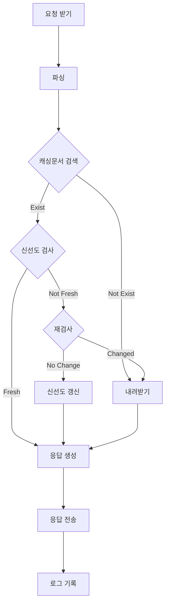

- 들어가기 전 용어 정리: 
    - 웹 캐시: 자주 요청 받는 문서의 사본을 자동으로 보관하는 HTTP 장치. 
    - 캐싱: 문서를 이렇게 사본으로 보관하는 일
    - 캐시된 문서: 보관된 사본.

# 7.1 불필요한 데이터 전송
- 현상: 동일한 리소스를 복수의 클라이언트가 서버에게 요청 시 동일한 바이트가 대역폭을 차지하는 낭비 발생.
- 캐시가 주는 도움: 서버 대신 캐시가 보관해둔 사본을 전송함으로써 서버에 갈 부하를 분담한다.

# 7.2 대역폭 병목
- 현상:  경유 커넥션이 많아지고, 전체 경로가 길어질수록 네트워크 병목[^1]이 강해진다. 
- 캐시가 주는 도움: 서버보다는 클라이언트에 가까운 로컬 네트워크에 속한 캐시가 더 넓은 대역폭을 제공한다.
[^1]: 전체 경로 중 가장 대역폭이 좁은 커넥션이 전체 경로의 속도가 되는 문제

# 7.3 갑작스런 요청 쇄도
- 요청 쇄도(Flash crowds): 짧은 시간 동안 요청이 급속히 증가하는 현상.
- 캐시가 주는 도움: 갑작스런 요청을 캐시가 분담할 수 있다.

# 7.4 거리로 인한 지연
- 현상: 거리가 늘어나면서 네트워크 라우터를 경유할수록 통신 시간은 늘어난다.
- 캐시가 주는 도움: 서버보다 클라이언트와 더 가까운 캐시에게 응답을 얻을 수 있어 통신 시간을 감소시킬 수 있다.

# 7.5 적중과 부적중
- 용어:
    - 캐시 적중(cache hit)[^2]: 클라이언트 요청에 대응하는 사본이 있는 경우를 이름.
    - 캐시 부적중(cache miss): 캐시 적중과 반대로 요청 사본이 없는 경우를 이름. 이 경우 요청은 서버로 전달되야 한다.
[^2]: 책에서는 재검사와 비교해서 '순수 적중'이라고 부르기도 한다.

## 7.5.1 재검사
- HTTP 재검사(revalidation): 서버 컨텐츠가 캐시된 사본과 동일한지(=신선한지) 점검.
- 재검사 방식: 서버에게 컨텐츠를 받아 비교하는 대신 캐시 쪽에서 재검사 요청을 보내며, 그 요청은 HTTP에서 정의.
    - 이유: 컨텐츠 이동보다 재검사 요청이 더 적은 트래픽만 쓰면 되니까.
- 재검사 요청 시점: 클라이언트가 사본을 요청 and 사본이 검사할 필요가 있을 정도로 오래됨.
- 재검사 과정:
    - 신선한 경우: 서버는 304(Not Modified) 코드를 응답으로 보내고, 이를 받은 캐시는 사본을 클라이언트로 전송('재검사 적중'이라고 함).
    - 신선하지 않은 경우: 서버는 컨텐츠를 발송하고 캐시는 이를 사본으로 저장한 후 클라이언트에게 전송.
- 응답의 빠르기로는 순수 적중 > 재검사 적중 > 부적중 순으로 빠르다.
- 재검사 요청에 포함되는 사항:
    - If-Modified-Since 헤더: 캐시된  시간 이후에 변경된(=신선하지 않은) 경우에만 사본을 요청한다는 의미. 
- GET If-Modified-Since 재검사 요청 시나리오:
    - 서버 컨텐츠가 변경되지 않은(=신선한) 경우: 재검사 적중
        - 서버는 커넥션에 연결된 자신의 클라이언트(캐시)에게 304(Not Modified) 응답을 전송. 캐시는 클라이언트에게 자신이 보관하던 사본을 엔터티 본문에 달아 200 응답을 전송.
    - 서버 컨텐츠가 변경된(=신선하지 않은) 경우: 미적중
        - 서버는 캐시에게 200(OK) 응답을 전송.
    - 서버 컨텐츠가 삭제된 경우:
        - 서버는 캐시에게 404(Not Found) 응답을 전송. 
        - 캐시는 사본을 삭제

## 7.5.2 적중률
- 캐시 적중률[^3]: 전체 요청 중에서 캐시가 요청을 처리하는 비율.
    - 0: 모든 요청 미적중
    - 1: 모든 요청 적중
- 적중률[^4]에 영향을 미치는 요인:
    - 캐시의 크기
    - 캐시에 연결된 클라이언트들의 관심사가 겹치는 정도
    - 캐시된 데이터가 갱신되는 빈도
    - 캐시의 설정

[^4]: 재검사 적중은 보통 여기 포함하지 않는다.
[^3]: 캐시 적중비, 문서 적중률, 문서 적중비라고도 부른다.

## 7.5.3 바이트 적중률
- 바이트 적중률: 응답 전체(서버 + 캐시)가 차지하는 bytes 중 캐시가 응답한 bytes의 비율
- 지표로서 지니는 의미:
    - 문서 적중률: 높을수록 서버를 오가는 트랜잭션이 없다는 뜻이므로, 전체 대기 시간이 줄어든다.
    - 바이트 적중률: 높을수록 사용 대역폭 감소로 이어진다.

## 7.5.4 적중과 부적중의 구별
- 응답에는 출발지가 캐시였는지 서버였는지 알려주는 헤더가 없다. 컨텐츠가 삭제되지 않은 한 어느 쪽이든 200 (OK)가 전송.
- 캐시로부터 왔는지 서버로부터 왔는지 구별하는 꼼수:
    - Date 헤더: 메시지 발행 datetime을 의미.
    - Age 헤더: 

# 7.6 캐시 토폴로지
- 캐시 사용자의 수에 따른 구분:
    - 개인 정요 캐시(private cache): 오직 한 클라이언트와 통신. (7.6.1)
    - 공용 캐시(public cache): 다수의 클라이언트와 통신. (7.6.2)

## 7.6.1 개인 전용 캐시
- 브라우저에 내장된 캐시가 대표적
    - 캐시된 문서는 브라우저가 설치된 PC의 디스크에 저장된다.
    - 크롬, 파이어폭스의 경우 URI 입력 폼에 `about:cache`를 입력해서 확인할 수 있음

## 7.6.2 공용 프락시 캐시
- 공용 캐시 = 캐시 프락시 서버 = 프락시 캐시: 캐싱 목적의 프락시 서버
- 역할: 
    - 로컬 캐시에서 문서를 제공
    - 서버에 접근해서 문서를 캐싱
- 프락시 캐시와 개인 전용 캐시의 비교
    - 개인 전용 캐시: 신선한 하나의 컨텐츠를 N회 요청
    - 프락시 캐시: 신선한 하나의 컨텐츠를 1회 요청 후 N 클라이언트들에게 전달.
- 프락시 캐시 사용 제어:
    - 프락시를 사용하도록 설정한 방법으로 프락시 캐시 사용을 설정
    - 인터셉트 프락시([[20장 리다이렉션과 부하 균형|20장]])로 요청이 프락시 캐시를 경유하도록 지정.

## 7.6.3 프락시 캐시 계층들
- 발상: '클라이언트 - 캐시 - 캐시 - 서버'로 복수의 캐시를 잇는다.
    - 클라이언트에 가까울수록 소규모 네트워크를 담당하여 캐시 성능은 낮다.
    - 클라이언트에서 멀어질수록 소규모 네트워크가 모인 더 큰 지역 네트워크를 담당하여 캐시 성능은 높아져야 한다.

## 7.6.4 캐시망, 콘텐츠 라우팅, 피어링
- 정/동적 계층 ([[6장 프락시#6 3 2 프락시 계층|프락시 유사 구조]]):
    - 정적: 어떤 부모 캐시로 갈지는 이미 결정돼 있으며 바뀌지 않는다.
    - 동적: 어떤 부모 캐시로 요청을 보낼지 자식 캐시가 결정한다.
        - 형제 캐시: 선택적 [[6장 프락시#^peering|피어링]] 지원 캐시. 
            - 요청이 서버로 가는 대신 네트워크 간 캐시 문서 교환이 이루어진다.
            - HTTP를 확장한 ICP, HTCP 프로토콜이 필요([[20장 리다이렉션과 부하 균형|20장]])

# 7.7 캐시 처리 단계

^cache-flowchart

## 7.7.1 1단계: 요청 받기
캐시는 연결된 커넥션에서 요청을 받는다. 

## 7.7.2 2단계: 파싱
요청 메시지를 분해하여 자료 구조에 담는다.

## 7.73. 3단계: 검색
파싱된 URI와 일치하는 캐시 문서가 있는지 검사. 
- 로컬 복사본의 위치:
    - 메모리
    - 디스크
    - 인접 장치
- 캐싱 객체가 포함하는 정보:
    - 서버 응답 본문과 헤더
    - 캐시에 잔존한 기간
    - 응답에 사용된 횟수

## 7.7.4 4단계: 신선도 검사
신선한지 [[7장 캐시#7 5 1 재검사|HTTP 재검사]] 실시.

## 7.7.5 5단계: 응답 생성
- 캐싱 문서를 토대로 구성한 응답일지라도 서버에서 온 응답처럼 보이게 만들어야 한다.
    - 방법: 캐싱 객체에 포함돼 있던 서버 응답 헤더를 토대로 헤더 필드 구성.
    - `Date` 헤더(원래 메시지 최초 생성 datetime)는 건드려서는 안된다.

## 7.7.6 6단계: 전송
응답 헤더가 준비되면 응답을 클라이언트에게 전송. 클라이언트와는 커넥션을 유지하고 있었어야 한다.

## 7.7.7 7단계: 로깅
- 로그에 적을 내용:
    - 통계:
        - 캐시 적중 횟수
        - 부적중 횟수
    - 요청 종류
    - URL
    - 일어난 일
- 자주 쓰이는 포맷:
    - Squid log format
    - Netscape extended common log format

## 7.7.8 캐시 처리 플로 차트
(본 내용은 [[#^cache-flowchart|7.7장]]의 머리 쪽에 있는 것과 동일하다)

# 7.8 사본을 신선하게 유지하기
[[7장 캐시#7 7 4 4단계 신선도 검사|신선도 검사]]에서 언급했듯 캐시된 객체는 수명이 있으며, 이를 넘으면 재검사를 실시하여 사본을 신선하게 유지해야 한다. 이를 위한 방법으로 HTTP는:
    - 문서 만료
    - 서버 재검사
의 매커니즘을 정의한다.
## 7.8.1 문서 만료
- 문서에 유효기간 매기기: 이 기간 내 문서들은 실제 서버 상태와 관계 없이 '신선하다'고 판단.
    - Cache-Control 헤더
    - Expires 헤더
만료 시 서버에서 새 문서를 받고 신선도를 갱신해야 한다.

## 7.8.2 유효 기간과 나이
| 헤더명 | HTTP 버전 | 설명 |
| -- | -- | -- |
| Cache-Control: max-age | 1.1 | '서버에서 문서 최초 생성 시점 + `max-age`'가 만료 시점(단위: 초) |
| Expires | 1.0+ | 만료 시점 datetime 명시 |

## 7.8.3 서버 재검사
- 문서 '만료'의 의미: 캐시 문서가 서버 리소스와 다르단 뜻이 아니라, 이제 재검사할 때가 됐다는 의미
- 서버 재검사 이점:
    - 매 요청마다 신선도 확인 불필요
    - 서버 트래픽 절약
    - 사용자 응답 시간 개선
- 재검사 결과:
    - 변경됨: 신선하지 않으므로 새 사본을 가져와 캐싱한 뒤 클라이언트에게 전송.
    - 만료되지 않음: 사본 없이 새 만료일을 포함한 헤더들만 새로 받아 캐시 객체를 갱신.
- 용어 비교:
    - 신선하다: 캐시 문서와 서버 문서가 일치한다.
    - 만료됐다: 캐시 문서 유효 기간이 끝나 재검사로 신선도를 파악해야 한다.
- 캐시는 다음 중 하나를 응답으로 반환해야 한다
    - 신선한 문서:
        - 만료 기간 전이어서 순수 검사로 신선하다 파악한 캐시 문서
        - 만료 돼 재검사를 거쳐 신선하다고 파악된 문서
    - 신선하다 볼 수 없는 문서:
        - 에러 메시지(재검사 실패)
        - 경고 메시지가 담긴 캐시 사본

## 7.8.4 조건부 메서드로 재검사
- 조건부 GET: 재검사 결과 신선하지 않은 경우만 객체 본문을 전송하란 의미.
- 신선하지 않으면 내려 받아야 하니 GET 메서드와 결합하는 일이 잦다.
- HTTP가 정의한 조건부 요청 헤더 5가지
    - **If-Modified-Since**: 값으로 주어진 날짜 이후로 문서가 수정됐다면 Last-Modified 응답 헤더를 실어 요청 메서드 처리.
    - If-Unmodified-Since
    - If-Match
    - **If-None-Match**: 값으로 날짜 대신 태그를 지정하며, 서버 문서와 캐시 문서의 태그를 비교 대상으로 삼는다. 
    - If-Range

## 7.8.5 If-Modified-Since: 날짜 재검사
If-Modified-Since 헤더를 지닌 조건부 메서드 요청을 통칭 'IMS 요청'이라 부른다.
- 요청 리소스가 
    - 조건에 일치(=변경): 새 문서가 엔터티 본문에, 새 만료 날짜와 다른 정보가 헤더로 들어온 200 OK 응답이 반환된다. 
    - 조건에 불일치(=그대로): 새 만료 날짜 등 갱신이 필요한 헤더만 포함해서 304 Not Modified 응답 반환.
- Last-Modified: 최근 문서 변경 일시로서 IMS 요청의 응답에 포함시켜야 한다.

## 7.8.6 If-None-Match: 엔터티 태그 재검사
- 최근 변경 일자(Last-Modified) 비교로 문서 신선도를 알기 어려운 경우:
    - 문서 내용은 그대로면서 갱신은 된 때(`touch` 등 명령이나, 자동 스크립트에 의해 무조건 변경이 이루어진 경우)
    - 변경 내용이 사소한 것일 때(주석 내용, 공백 정리 등)
    - 초 단위보다 더 정밀한 단위로 갱신이 일어날 때
- ETag: 리소스의 버전을 의미.
    ```
    # Request
    GET /announce.htm HTTP/1.0
    If-None-Match: "v2.6"
    
    # Response
    HTTP/1.0 304 Not Modified
    Date: Wed, 03 Jul 2002, 19:18:23 GMT
    ETag: "v2.6"  # 2.6보다 높으면 200 OK였을 것이다.
    Expires: Fri, 05 Jul 2002, 05:00:00 GMT
    ```
- If-None-Match는 여러 ETag를 나열할 수 있다: `If-None-Match: "V2.6", "v.2.7"`

## 7.8.7 약한 검사기와 강한 검사기
- 캐시 검사기: 캐시된 문서가 신선한지 확인하기 위한 기준을 가리킨다(ETag, Last-Modified)
    - 약한 검사기(weak validator): HTTP/1.1에서 지원. 콘텐츠가 살짝 바뀐 정도는 변경으로 치지 않는 느슨한 검사기. 검사기 앞에 `W/` 접두사(대문자로 쓸 것)를 붙인다.
        - ETag: W/"v2.6"
        - If-None-Match: W/"v2.6"
    - 강한 검사기(stroong validator): 콘텐츠가 조금이라도 바뀌면 변경으로 치는 엄밀한 검사기.
- 이전에 사용한 ETag는 다음 버전에 붙이면 안된다.

## 7.8.8 언제 ETag를 쓰고, 언제 Last-Modified를 써야 하는가
- 서버는 가능하면 
    - ETag 검사기를 보내야 한다.
    - 강한 검사기를 보내나, 약한 검사기 또한 괜찮다.
    - Last-Modified로 유효 기간 검사기를 같이 보낼 수 있다면 좋다.

- 클라이언트는 
    - 서버가 Etag를 반환하는 경우: If-None-Match로 요청해야 한다.
    - Last-Modified를 반환하는 경우: If-Modified-Since로 요청해야 한다.
    - 둘 다 반환하는 경우: 둘 다 대응하는 캐시 검사기를 써야 한다.

- 서버나 캐시는 클라이언트에게 받은 요청에 태그와 유효 기간 2종류 캐시 검사기가 붙어 있다면, 두 캐시 검사기에서 모두 '변경 없음'이 뜨지 않는 한 304 Not Modified로 응답하면 안된다. 

# 7.9 캐시 제어
- 문서 만료 기간 설정 방법:
    - 서버가 제어:
        - Cache-Control: no-store([[7장 캐시#7 9 1 no-cache와 no-store 응답 헤더|7.9.1]])
        - Cache-Control: no-cache([[7장 캐시#7 9 1 no-cache와 no-store 응답 헤더|7.9.1]])
        - Cache-Control: must-revalidate([[7장 캐시#7 9 4 must-revalidate 응답 헤더|7.9.4]])
        - Cache-Control: max-age([[7장 캐시#7 9 2 max-age 응답 헤더|7.9.2]])
        - Expires([[7장 캐시#7 9 3 Expires 응답 헤더|7.9.3]])
    - 캐시가 제어:
        - 헤더 없이 Heuristic 방법으로 캐시가 스스로 결정[[7장 캐시#7 9 5 휴리스틱 만료|7.9.5]])

## 7.9.1 no-cache와 no-store 응답 헤더
- `Cache-Control: no-store`: 캐싱 금지
- `Cache-Control: no-cache`: 값만 보면 헷갈리겠지만, 캐싱은 가능하다. 단, 캐시 사본으로 응답하기 전 재검사를 필히 거쳐야 한다.
- `Pragma: no-cache`: 1.0+과 호환성을 유지하기 위해 1.1에 포함됨. 그러나 이 헤더만 이해할 수 있는 어플리케이션 대응이 아니라면 no-cache 구현을 우선해야 한다.

## 7.9.2 max-age 응답 헤더
- `Cache-Control: max-age=3600`: 서버에서 응답이 생성된 시점부터 지정된 max-age 시간 이내를 신선한 문서로 간주하겠다는 의미.
- `Cache-Control: s-maxage=3600`: 공용 캐시에만 적용

## 7.9.3 Expires 응답 헤더
- `Expires`: 만료 시점의 datetime. 그러나 많은 장비들의 시간이 동기화돼 있지 않거나 부정확할 수 있어, 경과 시간 기준을 더 선호.
    - 주의점: 항상 재응답을 유도하는 등의 목적으로 `Expires: 0` 값을 0으로 맞추는 일은 문법 위반이다. 이러한 응답을 받아들일 수는 있어도 생성해서는 안된다.

## 7.9.4 must-revalidate 응답 헤더
- 서버는 만료된 문서라도 응답으로 보낼 수 있다.
- `Cache-Control: must-revalidate`: 만료된 사본은 무조건 재검사를 거쳐 사용해야 함을 명시해서 이런 동작을 막을 수 있다.
- 서버와 통신이 불가능한 상태라면 캐시는 504 Gateway Timeout erro를 반환할 것.

## 7.9.5 휴리스틱 만료
- 캐시의 유효 기간을 알 수 있는 정보가 아무 것도 없는 경우 최대 나이 임의 계산.
- 계산된 최대 나이 > 24 hours라면 Heuristic Expiration 경고 헤더를 응답에 실어야 한다.
- LM 인자 알고리즘: Last-Modified 헤더가 있는 경우 사용 가능.
    - 캐시된 문서의 마지막 변경이:
        - 오래 전: 자주 안 바뀌는 문서일 것이라고 가정. 최대 나이를 길게 잡는다.
        - 최근: 자주 변경되는 문서일 것이라고 가정. 최대 나이를 적게 잡는다.
    ```Python
    # server_date: 캐시-서버 통신 시각
    # last_modified: 마지막 문서 갱신 시각
    # lm_factor: (0, 1) 사이 마지막 경과 시간 내에서 최대 나이를 결정하기 위한 비율.
    
    elapsed_time_since_last_modified = max(0, server_date - last_modified)
    new_max_age = int(elapsed_time_since_last_modified * lm_factor)
    ```
- 유지 기간은 통산 1주일, 짧게는 1일 정도.
- 최근 변경일도 없다면 기본 신선도 유지 기간으로 설정(한 시간, 하루)
- 생각보다 자주 일어나는 계산

## 7.9.6 클라이언트 신선도 제약
- Cache-Control로 콘텐츠를 만료일을 연장할 수도 앞당길 수도 있다.
    - `Cache-Control: max-stale=<s>`: 만료 시간 + s 초 내에서 만료된 캐시 문서도 받겠다.
    - `Cache-Control: min-fresh=<s>`: 현재 시각 + s 초 내 신선한 문서만 받는다.
    - `Cache-Control: max-age=<s>`: 응답 생성부터 s 초 내 캐시 문서만 받는다.
    - `Cache-Control: no-cache`: 재검사 필수
    - `Cache-Control: no-store`: 캐시 문서는 받지 않는다. 이 헤더를 받은 캐시는 문서를 삭제해야 한다.
    - `Cache-Control: only-if-cached`: 클라이언트는 사본만을 응답으로 받겠다.

## 7.9.7 주의할 점
- 일어날 수 있는 문서 만료 설정 실수:
    - 유효기간을 너무 길게 잡은 경우
    - 유효기간을 사용하지 않는 경우

# 7.10 캐시 제어 설정

# 7.11 자세한 알고리즘(넘김)
# 7.12 캐시와 광고
## 7.12.1 광고 회사의 딜레마
컨텐츠 제공자 입장에서 캐시의 이점
    - 웹 서버의 부하를 분담하니 서버 비용이 감축
    - 중복 트래픽을 줄일 수 있어 네트워크 사용료 절약
    - 기사나 광고 같은 컨텐츠를 빠르게 응답으로 보낼 수 있음
- 컨텐츠 제공자 입장에서 캐시의 문제점
    - 서버로 요청이 들어오지 않을 수 있어 사용자들의 요청 횟수를 알 수가 없음. 

## 7.12.2 퍼블리셔의 응답
- 캐시 문제점을 해결하려는 현재 노력
    - CGI 게이트웨이[^CGI gateway]를 리소스 제공 어플리케이션 역할로 사용.
    - 같은 리소스 요청이라도 URL을 달리 생성하여 캐싱을 회피.
    - 회피 노력은 반대로 캐시의 이점을 죽여버린다.
- 이상적 문제 해결 형태: 캐시를 경유하지 못하게 하지 말아야 하며, 대신 캐시는 자신의 적중률을 서버에게 알려주어야 한다.
    - 적중 측정 방법1: 캐시는 클라이언트에게 요청을 받을 때마다 매번 서버에게 재검사를 요청한다.
        - 장점: 재요청은 실제 요청보다는 작다.
        - 단점: 트랜잭션 발생 그 자체로 비용을 소모한다.
    - 적중 측정 방법2: 로그 마이그레이션(7.12.3)

[^CGI gateway]: 웹 서버에서 동적인 페이지를 보여 주기 위해 임의의 프로그램을 실행할 수 있도록 하는 기술 **중 하나**

## 7.12.3 로그 마이그레이션
- 적중 측정 방법2: 서버는 요청을 받지 않으며, 캐시는 대신 모든 적중 로그를 서버에게 제공.
    - 단점:
        - 캐시 로그를 컨텐츠 제공자별로 분리하도록 표준화돼 있지 않다.
        - 적중 로그는 용량이 크다. 
        - 인증과 프라이버시 공개 우려가 있다.

## 7.12.4 적중 측정과 사용량 제한
- 적중 측정 방법3: 캐시 적중 횟수를 정기적으로 서버에게 Meter라는 헤더로 공유([[21장 로깅과 사용 추적|RFC 2227]]).
    - 사용량 제한: 캐시가 문서를 제공할 수 있는 횟수와 소모할 수 있는 처리 시간에 제한을 두고 이를 서버가 제어.