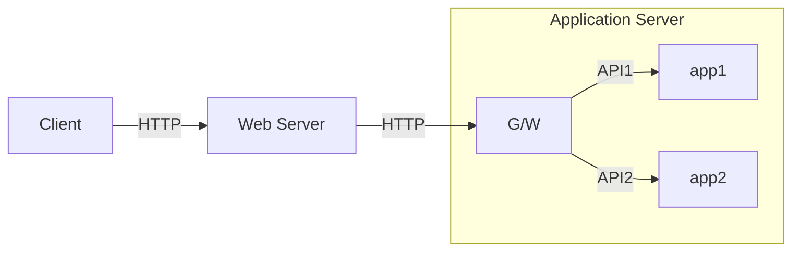

- 웹을 통한 폭넓은(정적 + 동적) 컨텐츠 제공 수요 증가
- HTTP 어플리케이션은 정적이든 동적이든 무관하게 일관된 인터페이스로 컨텐츠를 제공할 필요가 있음
- 이를 위해 HTTP를 기반으로 한 프로토콜 개발하거나 어플리케이션에 적용함.
    - HTTP를 모든 리소스에 대한 기본 프로토콜로 사용
    - 서로 다른 프로토콜로 작동하는 어플리케이션 간 공통 프로토콜로 사용
- 이 장의 목적:
    - 여러 종류의 리소스에 접근하는데 HTTP를 사용하는 방법
    - 이종 프로토콜, 어플리케이션 간 통신에 HTTP를 사용하는 방법

# 8.1 게이트웨이
- G/W의 탄생 배경: 정적 리소스 뿐 아니라 동적 리소스도 웹으로 배포해야 할 필요성 대두
- G/W의 역할: 
    - 리소스를 받기 위한 경로를 안내
    - 리소스와 어플리케이션을 연결: 리소스 요청을 API로 변환하고 이를 어플리케이션에게 전달해 리소스를 받아온다.
    - HTTP 프로토콜을 비 HTTP 프로토콜로 변환
- 리소스 G/W 구성 예:
    ```mermaid
    flowchart LR;
        Client <--> WebServer <--> G/W <--> DB;
    ```

## 8.1.1 클라이언트 측 G/W와 서버 측 G/W
- G/W를 통과하는 트래픽의 프로토콜 표기: `<Cli-ptcl>/<Serv-ptcl>`
- 용어: X = HTTP로 G/W와 통신하는 단말의 반대쪽, X-side G/W라고 부른다.
    - 서버 측 G/W: 클라이언트와 HTTP로 통신
    - 클라이언트 측 G/W: 서버와 HTTP로 통신

# 8.2 프로토콜 게이트웨이
- G/W에 HTTP 트래픽을 직접 보내는 방법:
    - 브라우저에서 보낼 G/W를 설정
        - FTP/HTTP G/W 설정 시 브라우저 동작:
            - HTTP 요청: G/W 거치지 않음.
            - FTP 요청: G/W를 거쳐 통과.
            ```mermaid
            flowchart LR;
                Client -- FTP URL을 담은 HTTP 요청 --> G/W
                Client -- HTTP 요청 --> WebServer
                G/W -- FTP --> WebServer
            ```
    - G/W를 대리 서버(리버스 프락스)로 앞세움.

## 8.2.1 HTTP/\*: 서버 측 웹 게이트웨이
- 클라이언트가 보낸 HTTP 요청을 외래 프로토콜로 변환
- HTTP/FTP 서버 측 G/W의 리소스 획득 순서:
    1. 로그인: USER, PASS 명령을 보내 서버에 로그인(제어 커넥션 생성)
    2. 디렉터리 변경: CWD
    3. 다운로드 형식 설정: TYPE A(ASCII)
    4. 문서 최근 수정 시간 획득: MDTM
    5. 데이터 검색: PASV(수동형 데이터 검색)
    6. 객체 검색: RETR
    7. 객체 수신: 제어 채널에서 수신한 포트 번호로 데이터 채널을 개방 후 수신
    ```mermaid
    flowchart LR;
        Client[HTTP Client] -- 1 --> GW[HTTP/FTP G/W]
        GW <--2 Control conn --> Server[FTP Server]
        GW <--3 Data conn--> Server
    ```
## 8.2.2 HTTP/HTTPS: 서버 측 보안 G/W
- 기업 외부에서 클라이언트가 HTTP로 요청을 보내면 이를 받은 G/W는 서버에 HTTPS로 변환된 요청을 보낸다.

## 8.2.3 HTTPS/HTTP: 클라이언트 측 보안 G/W
- 보안 가속기: 인터셉트 G/W나 대리 프록시로서 클라이언트가 보낸 요청을 복호화하여 서버와 통신.
- 성능 향상 방법: origin 서버보다 효율적인 복호화 알고리즘 내장하여 서버 역할을 분담.
- 주의점: G/W-서버 간 암호화되지 않은 통신 보안 강화

# 8.3 리소스 게이트웨이
- 어플리케이션 서버: G/W와 어플리케이션이 결합된 형태의 서버.

- CGI(Common Gateway Interface): 
    - 웹 서버가 사용하는 표준화된 인터페이스 집합
    - 리소스 URL을 요청하는 HTTP 메시지를 받아 프로그램을 실행시키고, 출력을 받아 HTTP 응답으로 회신하는 역할.
- 어플리케이션 서버가 통신하는 과정:
    1. 웹 서버가 클라이언트에게 받은 HTTP 요청을 G/W에게 전달.
    2. G/W는 메시지를 파싱하여 전달할 app이 요구하는 API에 맞춰 요청 재구성 후 전송
    3. G/W를 통과한 요청이 앱 서버 내에서 처리되는 과정:
        1. 헬퍼 어플리케이션을 생성해 요청 처리
        2. G/W를 통해 클라이언트로 전달할 어플리케이션의 결과를 반환.
    4. G/W는 전달 받은 어플리케이션 결과를 HTTP 프로토콜로 변환하여 웹 서버에게 반환.

## 8.3.1 공용 게이트웨이 인터페이스(CGI)
- 활용처:
    - 동적인 HTML 요청/응답 경로
    - 신용카드 처리
    - DB 질의
- CGI의 발전: 서버와 분리
- CGI의 추상화:
    - URL에서 'cgi', '?' 같은 것으로 짐작할 뿐, 사용자에게는 리소스 서버로 보낼 요청을 보낸다는 사실만 보임.
    - CGI-서버 간 통신 내용은 가려짐.
- CGI 장점:
    - 거의 모든 리소스 형식을 지원하며 필요하면 변형된 형식도 처리
    - 서버가 미지원하여 문제를 일으킬 법한 형식 확장을 처리함으로써 서버 에러 방지
- CGI 단점
    - 새로운 CGI 요청마다 새로운 프로세스를 생성해야 하는 자원 소모
- 개선책: Fast CGI. 데몬으로 동작하기에 프로세스 생성 소멸에 따른 성능 저하 해결.

## 8.3.2 서버 확장 API
- 개발 배경:
    - 서버 자체의 동작을 바꾸고 싶음
    - 서버의 처리 능력을 최적화
- 역할: 웹 개발자가 개발한 모듈을 서버와 직접 HTTP로 연결할 수 있는 인터페이스.
- 서버 자체의 아키텍처에 의존. MS에는 FrontPage Server Extension([[19장 배포 시스템|19장]])이라는 확장 API가 있음.

# 8.4 어플리케이션 인터페이스와 웹 서비스
- HTTP 기반 app 간 연결이 활성화되며 부상한 문제점:
    - 어플리케이션 간 데이터 교환 프로토콜 인터페이스에 따른 데이터 변환.
        - HTTP 헤더로는 표현하기 힘든 정보가 있을 수 있음.
    - 이러한 HTTP 확장 데이터 교환에 대해서는 [[19장 배포 시스템]] 참고.
- 문제점을 해결하기 위한 노력: 앱 간 통신 표준과 프로토콜 집합 개발
    - 이러한 통신 표준 및 프로토콜 집합을 '웹 서비스'로 부르게 되는 용어 의미 확장이 일어남.
    - 웹 서비스: 어플리케이션이 정보를 공유하는데 사용하는 HTTP 기반의 새로운 메커니즘.
    - SOAP[^SOAP]를 통해 XML을 사용하여 정보를 교환(요즘은 'REST를 통해 JSON을 사용하여'라는 말이 더 어울림.)

[^SOAP]: Simple Object Access Protocol의 약자로, HTTP 메시지에 XML을 어떻게 실어야 할지 정한 표준.

# 8.5 터널
- '터널'이란 말은 장치가 아닌 연결(connection)의 일종인 개념이다.
- 웹 터널: HTTP 프로토콜을 지원하지 않는 애플리케이션에 HTTP 프로토콜을 사용하여 접근하는 방법
    - 리소스 G/W와 비교:
        - 리소스 G/W: 프로토콜 인터페이스에 따라 데이터를 재구성.
        ```mermaid
        flowchart LR;
            cli[HTTP Client] <--HTTP conn\nHTTP형식--> G/W <-- FTP conn\nFTP형식 --> srv[FTP Server];
        
        ```
        - 터널 G/W: 터널을 통과하는 데이터는 변환 없이도 무조건 전송됨.
        ```mermaid
        
        flowchart LR;
            cli[HTTP Client] <--HTTP Tunnel\nFTP 형식 --> G/W <-- FTP --> srv[FTP Server];
        ```

## 8.5.1 CONNECT로 HTTP 터널 커넥션 맺기
- CONNECT 메서드: 터널 게이트웨이가 목적 서버와 포트에 TCP 커넥션을 맺어 클라이언트-서버 사이 오가는 데이터를 무조건 전달하기를 요청
- G/W로 터널을 연결하는 과정
    ```mermaid
    flowchart LR;
        Client <-- Tunnel --> G/W <-- SSL conn --> WebServer
    ```
    1. 클라이언트가 CONNECT 요청 전송
    ```
    CONNECT orders.joes-hardware.com:443 HTTP/1.0
    User-Agent: SuperBrowser: 4.2
    ```
    2. G/W는 메시지 정보를 토대로 서버와 TCP conn을 맺는다.
    3. G/W는` HTTP 200 Connection Established` 응답을 클라이언트에게 전송.
    4. 클라이언트가 응답을 받음으로써 HTTP 터널이 생성됨. 
    5. cli-srv는 이 터널을 매개로 통신.

- 문법:
    - 요청:
        - 보통 resource URL이 들어가는 자리는 호스트명과 포트변호가 들어감.
        - 선택적 헤더 필드가 오며, 헤드 필드의 마지막 줄은 CRLF.
    ```
    CONNECT home.netscape.com:443 HTTP/1.0
    User-Agent: Mozilla/4.0
    ```
    - 응답: HTTP 메시지가 아니라 raw data가 터널로 이동하기에 Content-Type 헤더는 불필요.
    ```
    HTTP 200 Connection Established
    Proxy-Agent: Netscape-Proxy/1.1
    ```

## 8.5.2 데이터 터널링, 시간, 커넥션 관리
- 터널을 통해 전달되는 데이터는 게이트웨이에서 볼 수 없다. 따라서 데이터에 대해 어떠한 가정도 해선 안된다.
- 터널링 성능 향상을 위해 CONNECT 요청에 대한 응답 수신 전에 데이터를 터널에 보낼 데이터를 발신할 수 있다. 
    - 전제:
        - 게이트웨이가 응답을 받기 전에 데이터를 처리할 수 있어야 한다.
        - G/W는 네트워크 입출력 요청이 헤더 데이터만을 반환해줄 것이라 가정할 수 없어서, 커넥션이 맺어지는 대로 헤더를 포함해서 읽어들인 모든 데이터를 서버로 전송해야 한다. %%무슨 소린지 모르겠어서 일단 책 내용 그대로 옮겨 적음.%%
        - 요청 후 데이터를 보내고 나면 클라이언트는 인증 요구나 200 외 응답에 대해 요청을 보낼 준비를 해야 한다.
- 터널이 끊기면 발생하는 일: 
    1. 끊어진 단말에서 온 데이터는 반대편으로 전달된다.
    2. 데이터를 수신한 나머지 한 쪽도 프락시에 의해 끊어진다.
    3. 미전송된 데이터는 버려진다.

## 8.5.3 SSL 터널링
- 웹 터널의 보안 측면 용도:
    - SSL 트래픽을 HTTP 트래픽만 허용하는 방화벽을 통과할 수 있다.
- 개발 배경:
    - 방화벽을 통과할 수 있는 암호화된 SSL 트래픽 전송.
- 방법:
    - HTTP 메시지에 암호화된 Raw data를 엔터티로 실어 터널로 보낸다.
- 직접 연결과 터널링 시나리오:
    - 직접 연결: 방화벽에 막혀 전송 실패
    - 터널링: 터널 G/W를 만나기 전까지 HTTP 터널을 통과하고, 이후에는 SSL 커넥션으로 전송된다.
- 터널링의 유용성: 포트가 제한된 방화벽을 통과할 수 있다.
- 터널링의 약점: 이 터널로 악의적인 트래픽이 유입될 수 있다. (터널 G/W는 통과하는 데이터를 감시할 수 없다고 했다. [[8장 통합점 - 게이트웨이, 터널, 릴레이 #8 5 2 데이터 터널링 시간 커넥션 관리|8.5.2]])

## 8.5.4 SSL 터널링 vs HTTP/HTTPS G/W


## 8.5.5 터널 인증
- HTTP의 타 기능들을 터널 구축에 응용할 수 있다. 예로 프락시 인증 기능으로 적법한 권한이 있는 클라이언트만 터널 구축을 허락하는 것이다.
    1. 클라이언트가 CONNECT 요청 발송
    2. G/W는 407 인증 요구를 반환
    3. 클라이언트는 인증 정보와 함께 CONNECT 요청 발송
    4. G/W는 성공 시 메시지를 서버에게 보내고 이후 과정은 통상 터널 생성 과정과 동일.

## 8.5.6 터널 보안에 대한 고려 사항들
앞서 말했듯 G/W는 터널을 지나다니는 트래픽을 감시할 수 없다. 오용을 막고자 HTTPS 전용 포트인 443같은 well-known 포트들만 터널링을 허용해야 한다.

# 8.6 릴레이
- 커넥션을 맺기 위해 HTTP 통신을 한 다음 바이트를 맹목적으로 전달한다.
- 장점: 구현 용이
- 단점: 상호 운용 문제를 야기할 수 있음. 
    - Keep-Alive 커넥션 hang 문제([[4장 커넥션 관리#4 5 6 Keep-Alive와 멍청한 dumb 프록시|유사 문제]])